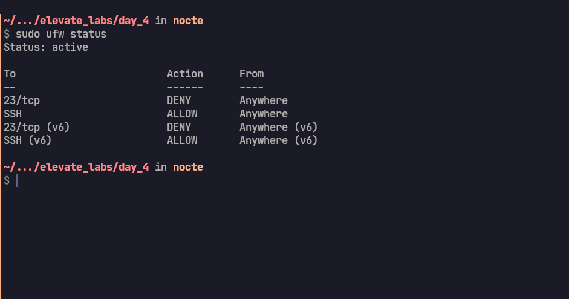

# Day 4: Firewalls (UFW) 

## Installation 

UFW was already installed on the Arch Linux distribution. Executing the follow command returned the firewall status

```sudo ufw status``` 

## Configuration 

The status command also revealed that there were no rules configured in the firewall. A firewall rule was added to block incoming telnet connections on port 23. 

```sudo ufw deny 23/tcp``` 

Once this was done, a netcat command was executed to check if the firewall was configured properly. This rule was tested by starting a netcat listener on port 23.

```sudo nc -lvnp 23``` 

Although the rule prohibited any incoming connections on port 23, I was able to connect to it locally using another netcat command. However connecting from my phone using Termux was not possible. Since ssh was in the ufw app list, the following command was used to allow incoming ssh connections. 

```sudo ufw allow SSH``` 

Both of these commands created a configuration as follows: 



Once the rules have been created, they were removed numerically. First this command was executed to provide numbering for each rule.

```sudo ufw status numbered``` 

Then each rule was deleted by specifying their numbers in the following command: 

```sudo ufw delete <number>```

This restored the firewall to its original status. 

## Summary 

A firewall is essentially a packet filtering mechanism that exists in the network layer. It filters packet by inspecting the packet headers to check the source IP address, destination IP address and the source/destination port. The firewall also has enough knowledge of existing sessions to discern legitimate connections. These are called stateful firewalls. In a stateful firewall, any outgoing packet to an IP with a port number would automatically allow an incoming packet from that IP in the same port. Few applications like Tailscale even leverage this to bypass NAT (Network Address Translation) and firewall in routers. 

